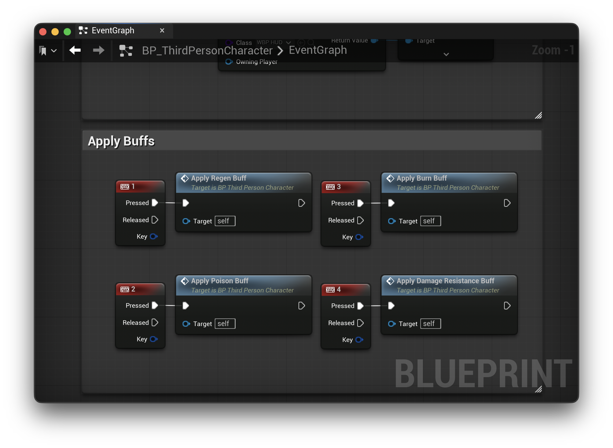
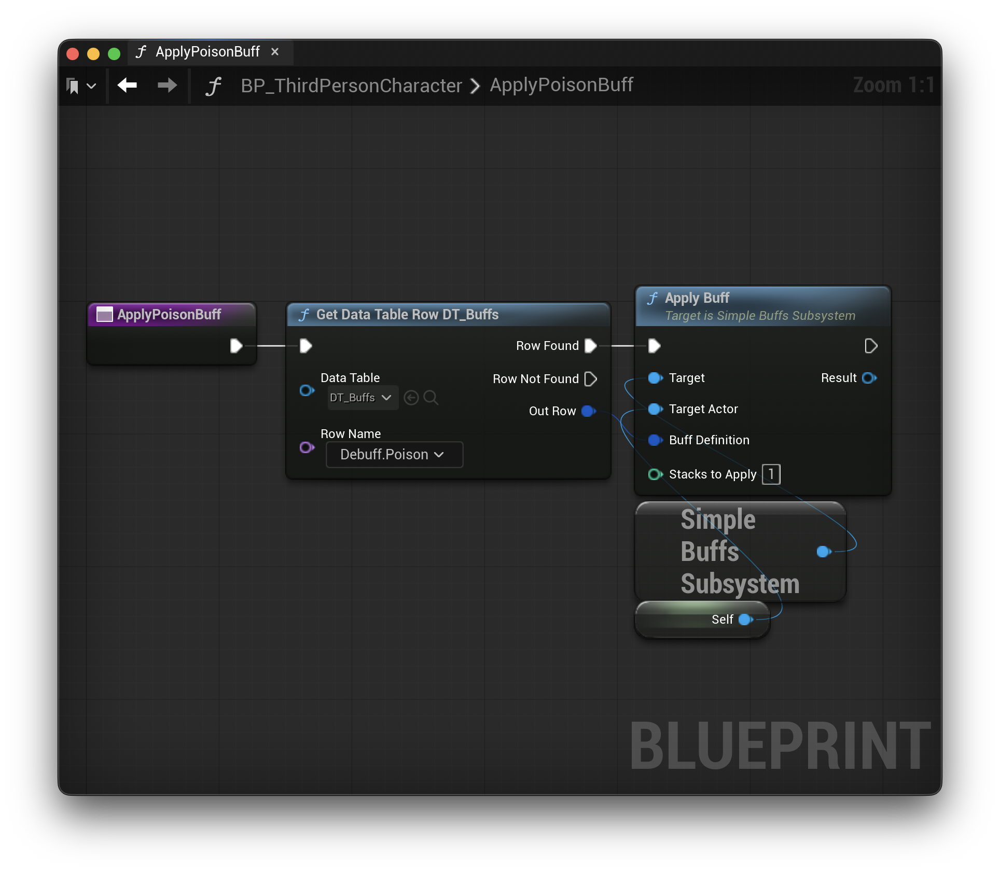
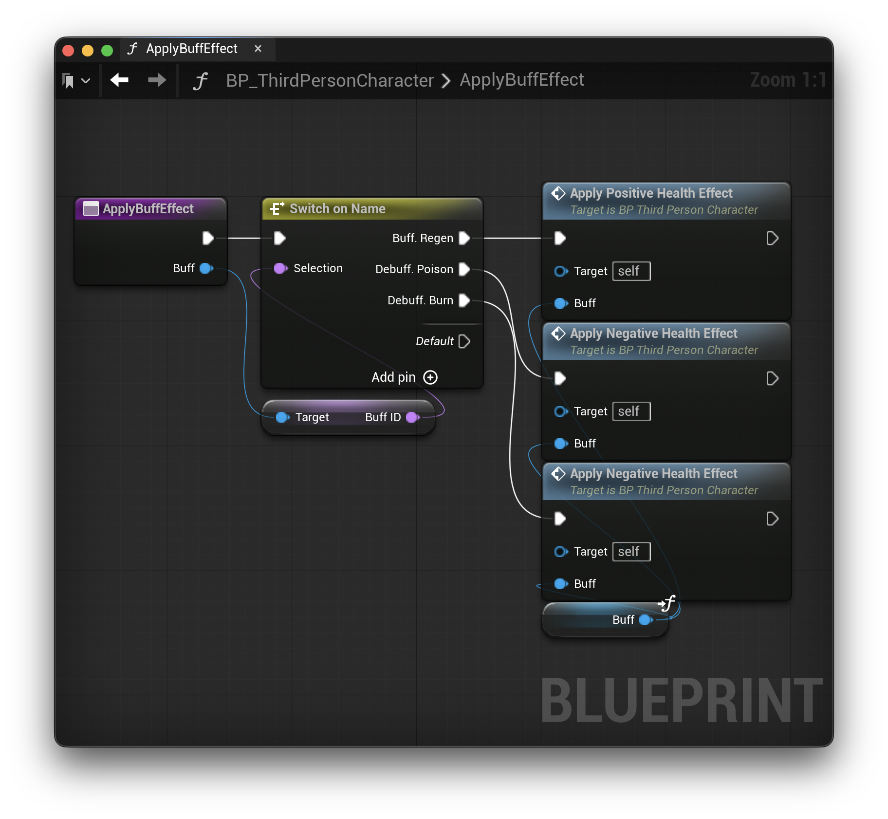
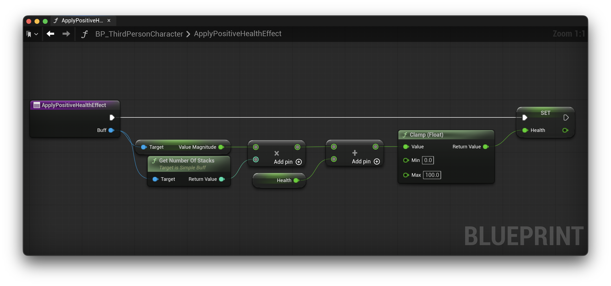
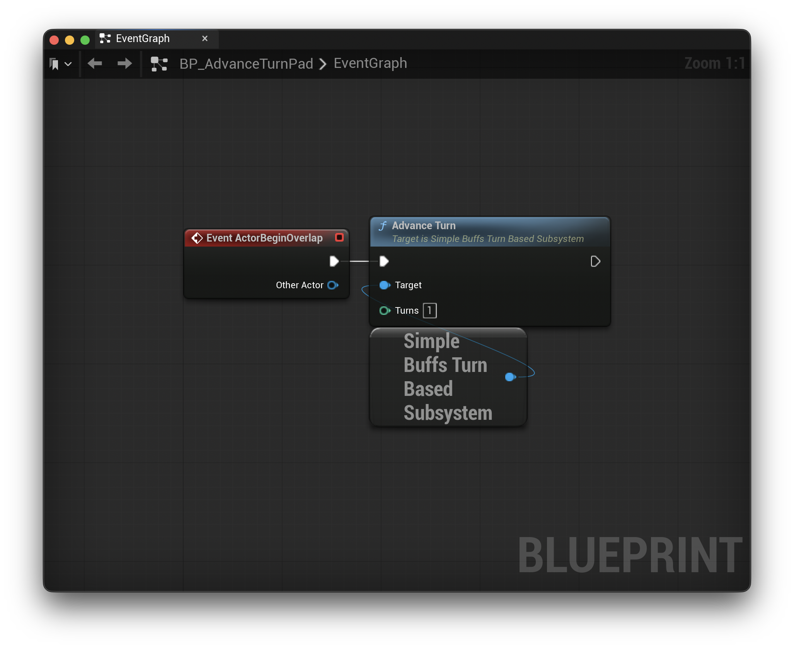
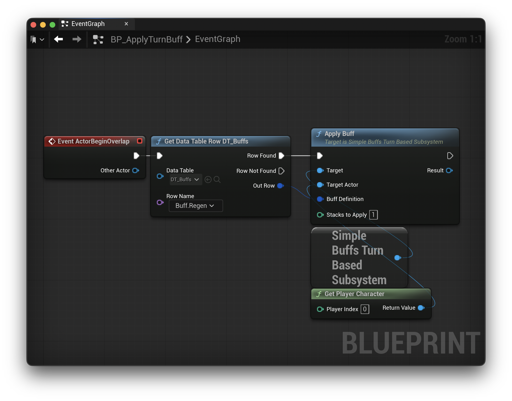
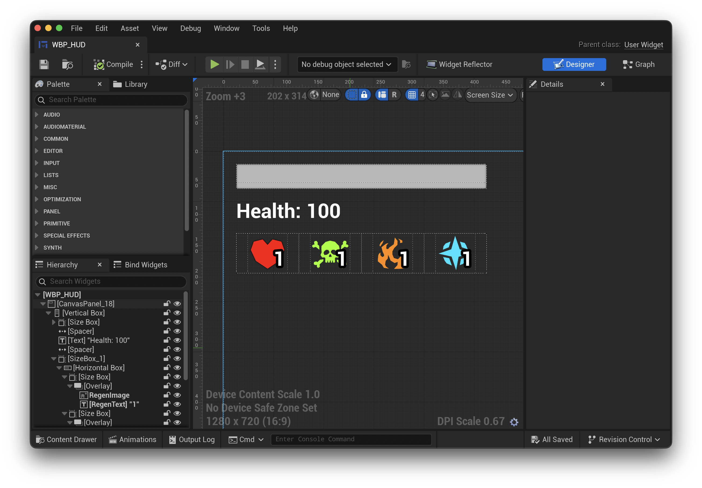
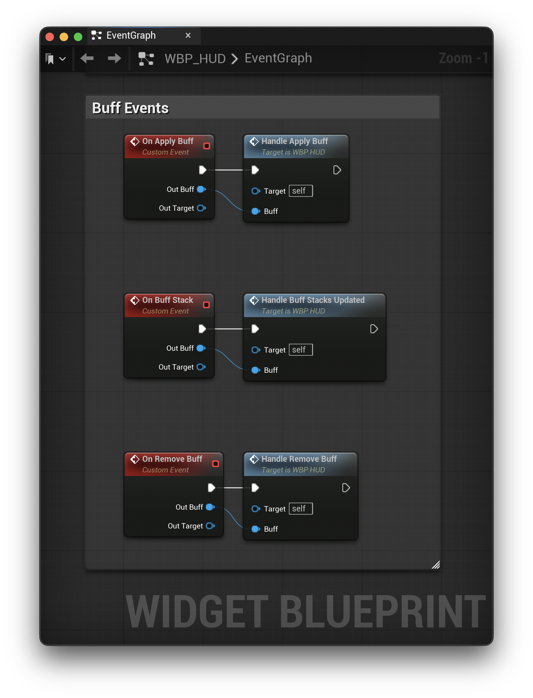

# Example Project

The provided example project shows a basic setup for **SimpleBuffs**. It defines four buffs via a Data Table and applies them via keyboard input in the `BP_ThirdPersonCharacter` blueprint. The buffs demonstrate different configurations over time and turns.

## Buffs Data Table

The available configurations in the above image are explained in detail in [Setup.md](./Setup.md).

### Example Buffs

* **Regen** - Regenerates the player's health over 10 seconds. Will refresh duration on stacking.
* **Poison** - Applies damage over 10 seconds. Configured to extend the duration on stack.
* **Burn** - Applies damage over 10 seconds. Can stack up to 3 times but will not refresh duration.
* **Damage Resistance** - Demonstrates a persistent buff that will not expire. Does **NOT** actually affect any damage modifiers.

## Real-Time Buffs

The `BP_ThirdPersonCharacter` is set up with a `Health` variable that is affected by the applied buffs. It also creates the UI widget displaying health and buff information.

In the `BP_ThirdPersonCharacter` blueprint, the keyboard keys 1 - 4 are configured to apply the 4 different buffs:

* Key 1 = Regen
* Key 2 = Poison
* Key 3 = Burn
* Key 4 = Damage Resistance

All functions retrieve the `FSimpleBuffDefinition` row struct from the Buffs Data Table and pass that over to the Real-Time Subsystem:

The `BP_ThirdPersonCharacter` implements the `ISimpleBuffsTarget` interface. This lets the player character handle buff applications directly with the `ApplyBuffEffect` function:

The `ApplyBuffEffect` function switches on the `BuffID` to determine whether to decrement or increment health. When **Regen** is applied, the `ApplyPostiveHealthEffect` is called and the player character's `Health` is increased.

While this setup is sufficient for a simple example, I recommend using the `Buff Metadata Row Handle` property to link your buffs to their respective attributes through the Data Table. This way you can avoid creating large switches for each `BuffID`.

## Turn-Based

There are two additional actors, the `BP_AdvanceTurnPad` and `BP_ApplyTurnBuff` blueprints. These let you simulate a turn-based buff setup by walking over the platforms.

`BP_AdvanceTurnPad` - Calls `AdvanceTurn(1)` on the Simple Buffs Turn Based Subsystem.

`BP_ApplyTurnBuff` - Applies the **Regen** buff to the player using the Simple Buffs Turn Based Subsystem. Therefore, **Regen** will last 10 turns instead of 10 seconds.

**Please Note:** All buffs and their timing / turns can all be observed in the **SimpleBuffs** Editor.

## HUD Widget

The example project also includes a custom HUD widget. It has the following elements:

* Progress bar linked to the player character's `Health` variable
* `Health` Text 
* Regen Buff Icon with stack count
* Poison Buff Icon with stack count
* Burn Buff Icon with stack count
* Damage Resistance Buff Icon with stack count

The four buff icons displayed on the HUD only appear when the buff is active. The stack count text updates every time a buff’s stack changes.

In addition, the HUD widget shows how to retrieve information on buffs at runtime by binding to the events from the subsystem:

The HUD widget uses switch statements to determine which icons to display. This was a quick setup for the example; for production, I recommmend building a dynamic widget that displays the buff icon from the data.
