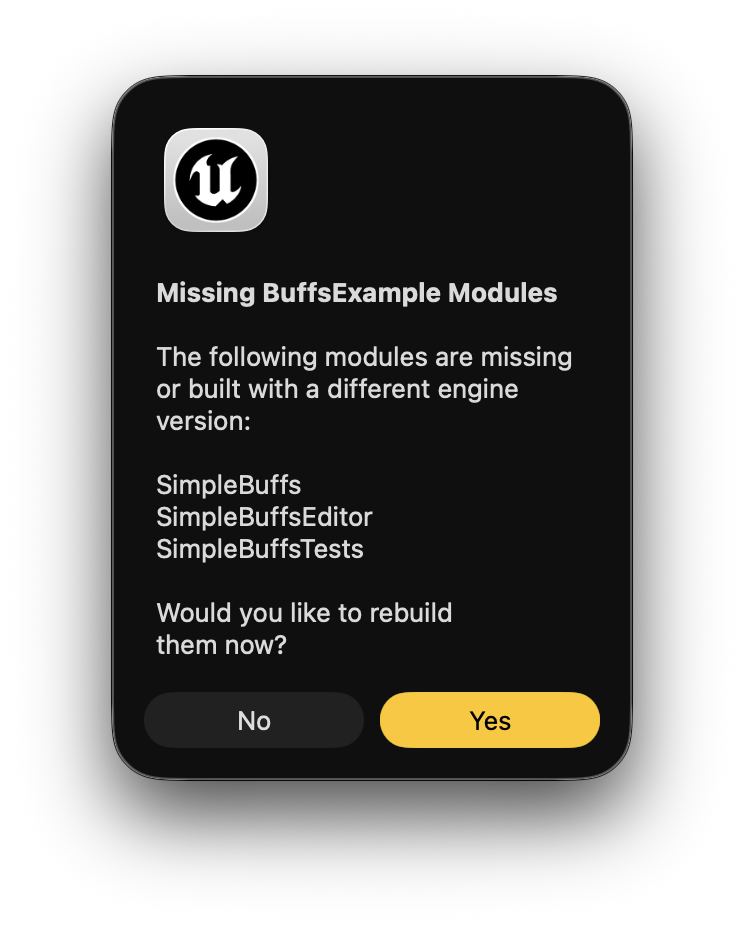

# Installation Guide

SimpleBuffs is typically installed via Fab/Unreal Marketplace. After downloading, enable the plugin in your project and restart the editor if prompted.

To install manually from source instead, follow these steps:

* Copy `SimpleBuffs/` into `Plugins/`.
* Open your project in Unreal Engine (you may be prompted to rebuild the project modules).

* Open `Edit -> Plugins` and enable **SimpleBuffs**, if not already enabled.
* Restart the editor if prompted after enabling the plugin.
* For C++ projects, add `SimpleBuffs` to your `.uproject` and `Build.cs` dependencies (see `docs/Setup.md`).

Please refer to [Setup Instructions](./Setup.md) to enable **SimpleBuffs** in your project.