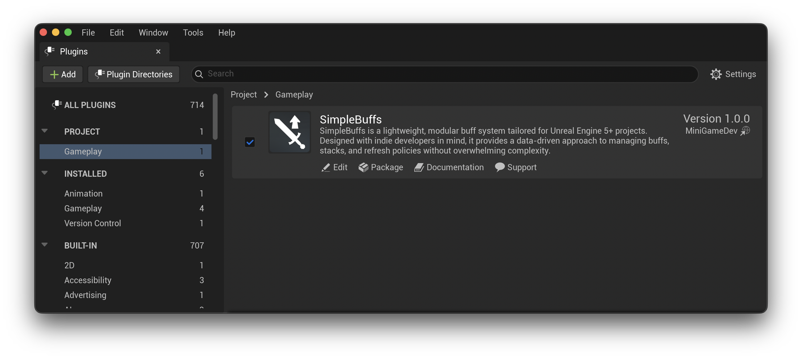
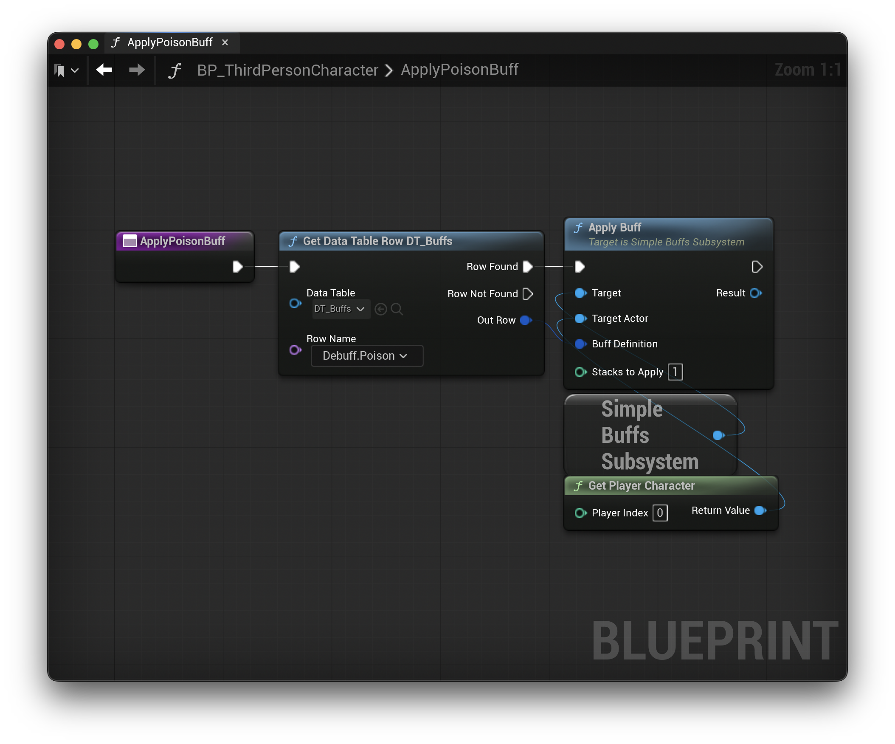
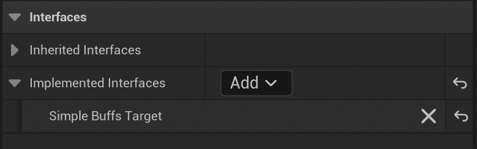
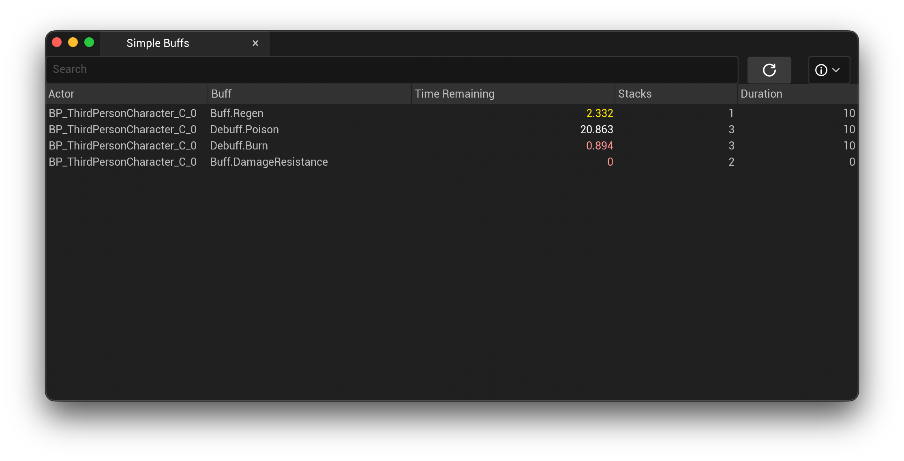

# Documentation

* [Installation](./Installation.md)
* [Setup](./Setup.md)
* [Debugging](./Debugging.md)
* [Example Project](./ExampleProject.md)
* [Storage](./Storage.md)
* [Advanced Usage](./AdvancedUsage.md)
* [API Reference](./APIReference.md)

## Supported Unreal Engine Versions

* Unreal Engine **5.4**
* Unreal Engine **5.5**
* Unreal Engine **5.6**
* Unreal Engine **5.7**

## Quick Start Guide

This Quick-Start shows you how to install the plugin, create your first buff, and apply it to an actor.

*All steps work in both Blueprints and C++.*

### 1. Enable the Plugin

1. Open Edit → Plugins
1. Search for **SimpleBuffs**
1. Enable it
1. Restart the editor if prompted
1. That's it.

### 2. Create Your Buff Data Table

1. SimpleBuffs loads all buff definitions from Data Tables using the Simple Buff Definition struct.
1. Right-click in the Content Browser
1. Select Miscellaneous → Data Table
1. Choose Simple Buff Definition
1. Save it as `DT_Buffs` (or any name)

Add a new row with the following values;

| Field             | Value          |
| ----------------- | ------------   |
| BuffID            | `Debuff.Poison`|
| BuffCategory      | `Nature`       |
| BuffName          | "Poison"       |
| ApplicationType   | Over-Time      |
| RefreshPolicy     | Extend         |
| MaxStacks         | 3              |
| bApplyImmediately | True           |
| Duration          | 5.0            |
| TickInterval      | 1.0            |
| SignType          | Negative       |
| ValueType         | Absolute       |
| ValueMagnitude    | 2              |

Your first buff is ready.

### 3. Apply a Buff In-Game

1. Create a `BP_PoisonPuddle` actor in your game.
1. Give it a collision component.
1. On `ActorBeginOverlap` apply the poison buff via a Data Table Row Handle.

### 4. React to Buffs on the Actor

1. In your player character blueprint or C++ class, implement the `ISimpleBuffsTarget` interface under *Class Settings*.
1. Implement ApplyBuff interface function.
1. Modify health based on buff.

### 5. View Buffs in the Editor

1. While running in PIE:
1. Open Window → Simple Buffs
1. Click Refresh
1. See all active buffs on all actors
1. Enable Automatic Refresh for real-time updates

### 6. That's It, You're All Set

At this point you can:

1. Add more buffs
1. Add categories (Poison, Fire, Ice, Resistance, etc.)
1. Apply multiple buffs to the same actor
1. Use real-time or turn-based modes
1. Subclass and customize buff behavior
1. Tie buffs into attributes, stats, gear, or skills
1. SimpleBuffs is now running inside your project.