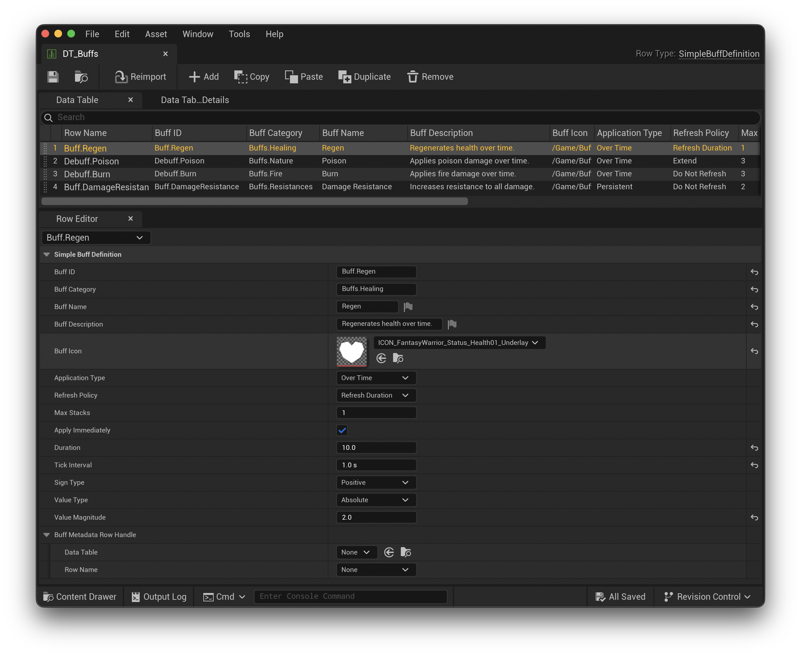

# Setup

*Please Note: All functionality is supported in both Blueprints & C++.*

Once the plugin is installed and enabled in Unreal Engine, pick the setup that matches your project:

* **Blueprint-only:** Enable the plugin and restart the editor.
* **C++ projects:** Add `SimpleBuffs` to both your module's dependencies and your `.uproject` file.

`<YourGame>.Build.cs` (add to `PublicDependencyModuleNames` or `PrivateDependencyModuleNames`):

```csharp
PublicDependencyModuleNames.AddRange(
    new string[]
    {
        "Core",
        "CoreUObject",
        "Engine",
        "AIModule",
        "UMG",
        "SimpleBuffs"
    });
```

`<YourGame>.uproject` (add under `Modules -> AdditionalDependencies` and the `Plugins` array). Here's the example's project file for reference:

```
{
    "FileVersion": 3,
    "EngineAssociation": "5.6",
    "Category": "",
    "Description": "",
    "Modules": [
        {
            "Name": "BuffsExample",
            "Type": "Runtime",
            "LoadingPhase": "Default",
            "AdditionalDependencies": [
                "Engine",
                "AIModule",
                "UMG",
                "CoreUObject",
                "SimpleBuffs"
            ]
        }
    ],
    "Plugins": [
        {
            "Name": "ModelingToolsEditorMode",
            "Enabled": true,
            "TargetAllowList": [
                "Editor"
            ]
        },
        {
            "Name": "StateTree",
            "Enabled": true
        },
        {
            "Name": "GameplayStateTree",
            "Enabled": true
        },
		{
			"Name": "SimpleBuffs",
			"Enabled": true
		}
    ]
}
```

## Create Data Table

The first step to using **SimpleBuffs** is to create a Data Table asset. All available buffs can be defined through a Data Table. You are free to use as many tables as you like.

To create a Data Table, navigate to your Content Browser, right click and navigate to `Miscellaneous -> Data Table`. Select `"Simple Buff Definition"` (this struct ships with the SimpleBuffs plugin) in the dialog.

The following data table from the example project defines four buffs:

* `Buff.Regen`
* `Buff.Poison`
* `Buff.Burn`
* `Buff.DamageResistance`



Each buff has the same metadata as all other SimpleX plugins and uses a `BuffID` for unique identification. However, the most important properties that determine how a buff is applied over time are the following:

### ApplicationType

The `ApplicationType` property on buffs determines how the buff is applied. There are two possible values:

* Over-Time
* Persistent

**Over-Time**

Buffs with an `ApplicationType` of Over-Time will only be applied for the time configured in the `Duration` property. In addition, this buff will be applied (`OnApplyBuff` event) every `TickInterval` over the `Duration`. So a buff with a `Duration` of 10 seconds and a `TickInterval` of 1 second will have 10 total applications.

*Examples:*

* Regens
* Poison
* Burn

**Persistent**

Buffs with an `ApplicationType` of Persistent will only be applied once per stack. These types of buffs do not use `Duration` or `TickInterval`. Since these types of buffs do not participate in ticking, they can only be removed by manually calling `RemoveBuff`.

*Examples:*

* Damage Resistances
* Gear or Charm based buffs
* Permanent Upgrades
* Passive Skills

**Apply Immediately**

The boolean field `bApplyImmediately` only applies to Over-Time buffs as Persistent buffs already apply immediately. When enabled, the buff will apply (`OnApplyBuff` event) once it is activated. Given the same 10 second `Duration` and 1 second `TickInterval`, if `bApplyImmediately` is enabled, this will result in 11 applications of the buff.

### Stacking

The `MaxStacks` property controls how many stacks a buff can accept. Stacking is applied on every application of a buff. Anytime a buff's stack is updated, the `OnBuffStacksUpdated` event is broadcast. This event should be used to update UI.

`bApplyImmediately` is only used on the activation of a buff and does not affect the stacking logic. When buffs receive a new stack, the buff will refresh its timer based on its `RefreshPolicy`.

**Please Note:** If you do not want a buff to have multiple stacks, using a value of 1 for `MaxStacks` will keep the buff from stacking. Any application of the buff after a stack of 1 will result in no change to the stack count.

### Refresh Policy

There are three types of `RefreshPolicy`. Each one will invoke different behavior when new stacks are applied.

**Do Not Refresh**

A buff with a `RefreshPolicy` of **Do Not Refresh** allows stacking, but the overall time the buff is alive will not change. This allows you to increase the potency of the buff without affecting its timing.

**Refresh Duration**

A buff with a `RefreshPolicy` of **Refresh Duration** allows stacking and will refresh its duration on each stack. In addition, this type of buff will refresh its duration even if `MaxStacks` has already been met. This means if a buff has a `MaxStacks` of 3 with current stacks at 3, applying another stack will not affect the stack count, but the duration will be reset to its original Duration.

**Extend**

A buff with a `RefreshPolicy` of **Extend** allows stacking and will extend its total time by the `Duration`. Stacking a buff with this type will increase its total duration and stack count. For example, if a regen buff (10 s `Duration`, 1 s `TickInterval`) has a `MaxStacks` of 3 with the **Extend** policy, applying the second stack will add the `Duration` to the current time, meaning the buff can be alive for up to 30 seconds.

**Please Note:** All refresh policies only apply their logic when stacking takes place after the first application. Therefore, **Refresh Duration** and **Extend** won't take place if the buff does not already exist even if the first application has multiple stacks applied.

## Using Buffs In Game

The main function(s) you will use is `ApplyBuff`. This is the entry point that will create the coordinator and buffs while your game is running. Each buff coordinator must be tied to an actor in the game world. Any actor can be targeted by a buff, but it's up to your game to decide what happens when the buff is applied.


**Apply Buff Parameters:**

* Target Actor - The actor this buff applies to.
* Buff Definition - The struct representing the buff instance that will be applied. The above screenshot retrieves this from the Data Table.
* Stacks to Apply - The number of stacks the buff will start with. Defaults to 1.

I recommend only applying buffs to a subset of your actors through Unreal's collision settings. This way, you can specifically target enemies, NPCs or only actors that are guaranteed to react to buffs. The Subsystems will not enforce this so you will want to be careful not to apply buffs to actors that won't react.

To help apply buffs to your enemies, NPCs, etc. you can use the `ISimpleBuffsTarget` interface. This interface will work with blueprints and allows the actor to directly react to buff applications. When events are triggered, such as `OnApplyBuff`, the system will send a separate event directly to the targeted actor, if it implements this interface.

### Updating UI

The example project shows how to update your UI when buffs are applied. To accomplish this, do **NOT** poll buffs in tick, instead use the provided delegates:

* OnApplyBuff
* OnBuffStacksUpdated
* OnRemoveBuff

Binding to these events on the subsystems in your Widgets will inform your UI of every buff that is applied in your game along with the target actor. Use this to display buffs for your player.

### Coordinators

When buffs are applied to actors, a new `USimpleBuffsCoordinator` object will be created for each actor. For memory and performance reasons, coordinators are created and destroyed based on the active buffs for the targeted actor.

This means coordinators are only alive for the duration of all active buffs. Therefore, the safest way to listen to buff applications, stacks, and removal is through the subsystems. I also recommend **NOT** storing any references to the `USimpleBuffsCoordinator` as they can expire and be removed from the subsystem at any time.

### ISimpleBuffsTarget Interface

There are three functions on this interface:

```c++
UFUNCTION(BlueprintCallable, BlueprintNativeEvent, Category="Simple Buffs Target")
void ApplyBuff(USimpleBuff* InBuff);

UFUNCTION(BlueprintCallable, BlueprintNativeEvent, Category="Simple Buffs Target")
void BuffStacksUpdated(USimpleBuff* InBuff);

UFUNCTION(BlueprintCallable, BlueprintNativeEvent, Category="Simple Buffs Target")
void RemoveBuff(USimpleBuff* InBuff);
```

Your player and enemy actors can implement this interface and you will not need to subscribe to the global events broadcast from the subsystems. These interface functions will only be called when a buff that pertains to the targeted actor is updated.

### Applying a Buff In-Game

To see the effects of a buff when it's applied, you must implement its behavior based on the configuration defined in the buff object. There are multiple properties you can use to determine how the buff will affect the target actor.

**Value Magnitude**

This is the raw float value you will apply to the target actor. This can be any value, but I recommend using the *Sign Type* property for negative values instead of putting a negative value here.

**Sign Type**

This determines if the effect is positive or negative. You can switch on this property to determine the overall effect value.

**Value Type**

This determines if the *Value Magnitude* should be interpreted as a percentage or an absolute value.

**Buff Metadata Row Handle**

This property is entirely optional, but it can allow you to simplify your overall approach. For example, you can create your own custom Data Table struct that accepts an attribute ID or reference. This way, a buff like `Buff.Regen` can be directly tied to your character's health attribute all through the data table. This prevents you from manually hardcoding which attributes are modified by buffs. If you are using an accumulation strategy, this same idea applies.

## Real-Time Buffs

The `USimpleBuffsSubsystem` is a real-time subsystem. It directly ties into the `UWorld`'s `Tick`. So any buffs that are applied using this subsystem will countdown their duration by `DeltaTime`. In addition, if the game lags for any reason and `DeltaTime` increases beyond a single `TickInterval`, all buffs are designed to catch up.

Given a buff with a 10 second `Duration` and a 1 second `TickInterval`, if `DeltaTime` comes in as 5 seconds, 5 `OnApplyBuff` events will be triggered. Your application code does not need to change to accommodate this behavior, it will happen automatically.

**Please Note:** At this time, there is no way to disable catch up behavior.

## Turn-Based Buff

The `USimpleBuffsTurnBasedSubsystem` is the turn-based subsystem. It has all the same functionality as the real-time subsystem, but it does not `Tick`. In addition, it has the following function:

```c++
UFUNCTION(BlueprintCallable, Category="Simple Buffs Turn-Based Subsystem")
void AdvanceTurn(int32 Turns = 1);
```

This applies the same effect as `Tick` in the real-time subsystem, but moves the buff forward by `Turns` instead of `DeltaTime`. Given a buff with a 10 second `Duration` and a 1 second `TickInterval`, each call to `AdvanceTurn(1)` will move the buff forward by 1 causing an `OnApplyBuff` event to be broadcast for each turn.

**Please Note:** The `USimpleBuffsSubsystem` and `USimpleBuffsTurnBasedSubsystem` can technically be used in tandem, however, buffs are only guaranteed to be unique within a single subsystem. Therefore, caution is advised if using both at the same time. 

## Storage

Buffs are transient by design. See [Storage.md](./Storage.md) for guidance on how to reapply buffs across saves, level transitions, or relaunches.
